# Table of Content
- [How to Generate a Certificate for VoIP Push Notification](#how-to-generate-a-certificate-for-voip-push-notification)
  * [Prerequisition](#prerequisition)
  * [Steps](#steps)
    + [Apple Developer Page](#apple-developer-page)
    + [Certificates, Identifiers & Profiles](#certificates-identifiers-&-profiles)
    + [Services Certificates](#services-certificates)
    + [Identifiers](#identifiers)
    + [Certificate Signing Request](#certificate-signing-request)
    + [Download the Certificate](#download-the-certificate)
    + [Keychain Access](#keychain-access)
    + [Export Certificate & Private Key into Personal Information Exchange (p12)](#export-certificate-&-private-key-into-personal-information-exchange-(p12))
    + [Save .p12](#save-p12)
    + [Password for .p12](#password-for-p12)
    + [Completed to Generate .p12](#completed-to-generate-p12)
- [Appendix](#appendix)
  * [How to Create CSR File](#how-to-create-csr-file)

# How to Generate a Certificate for VoIP Push Notification

## Prerequisition

* [Apple Developer Account](https://developer.apple.com)
* CSR file

> Refers to [How to Create CSR File](#How-to-Create-CSR-File)

## Steps

### Apple Developer Page

Login to your Apple Developer account. In your profile page select `Certificates, Identifiers & Profiles`

> To generate a new certificae, your role should be a developer or higher (app manager, admin)

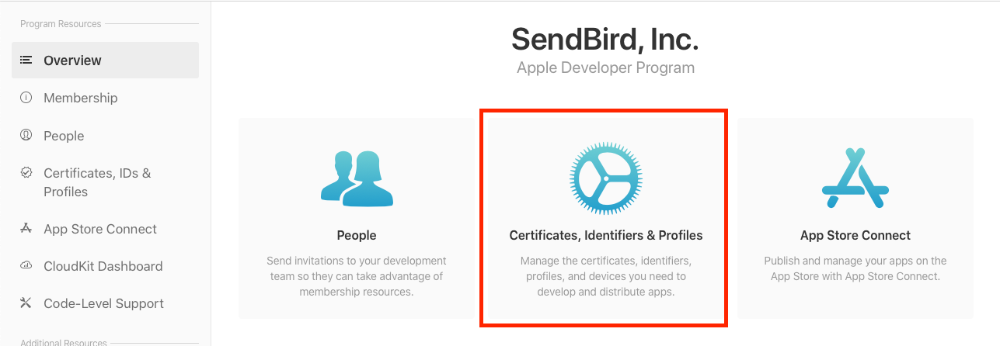

### Certificates, Identifiers & Profiles

Click '`+`' button to add a new certificate

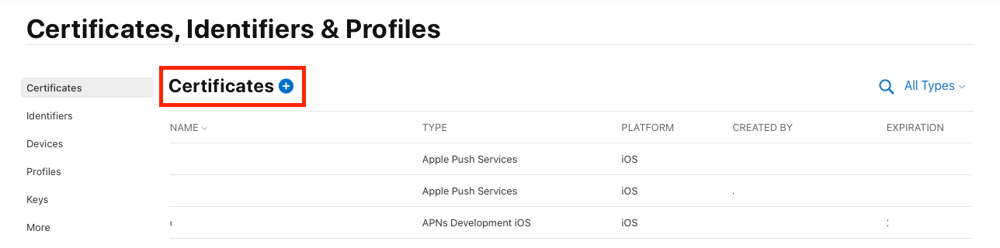

### Services Certificates

Select your certificate type. There are two types of certificate that can be used for VoIP. The one is `Apple Push Notification service SSL (Sandbox & Production)` and the other is `VoIP Services Certificate`.  

 `Apple Push Notification service SSL (Sandbox & Production)` is used for two services, **`VoIP Push Notification`** as well as **`Remote Push Notification`** (Actually it is also used for `ClockKit`, but we don't cover it now). And this certificate is used for `Sandbox` environment (we sometimes call it development, debug...) as well as `Production` environment (we sometimes call it distribution, release...). 

`VoIP Services Certificate` is used **ONLY** for **`VoIP Push Notification`**. And this certificate is also used for `Sandbox` environment` as well as `Production` environment.

>  If you are not an `app manager` or `admin` you will be limited to the types of certificates you can generate. You may need the help of your Apple Developer account `admin` or `app manager`.

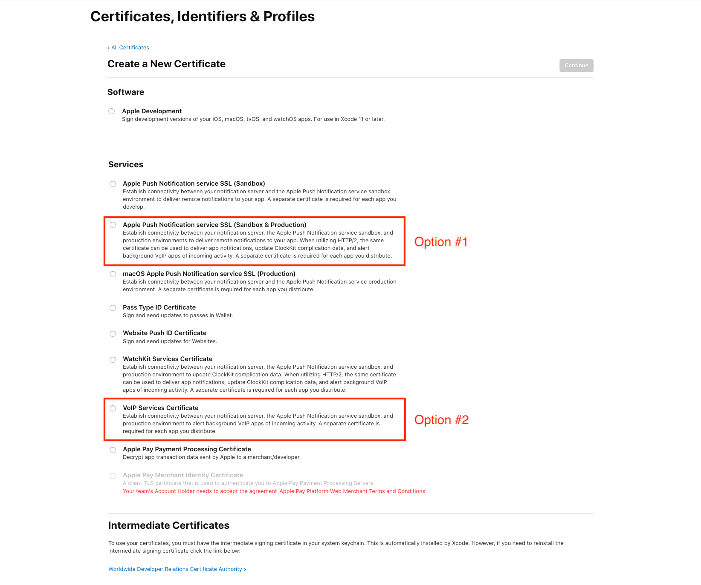

Click `Continue` button

### Identifiers

Assign the certificate to the identifier (bundle ID) of your project.

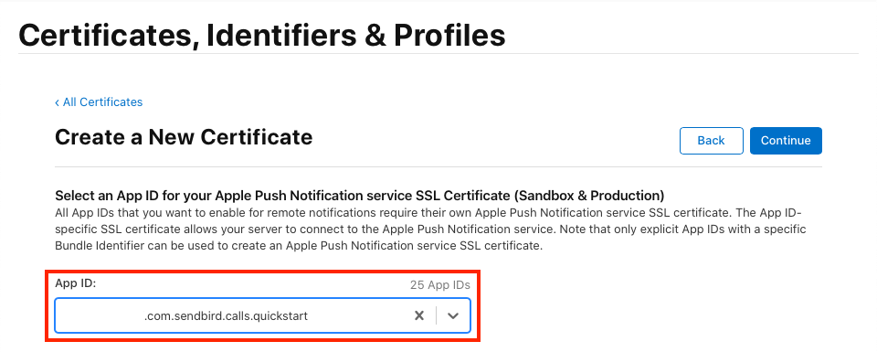

Click `Continue` button

### Certificate Signing Request

Upload your Certificate Signing Request. This process links your certificate to your CSR file. In the future, this certificate will be validated with this CSR file.

> If you don't have your Certificate Signing Request file yet, refer to [How-to-Create-CSR-File](#How-to-Create-CSR-File) to generate the CSR file.

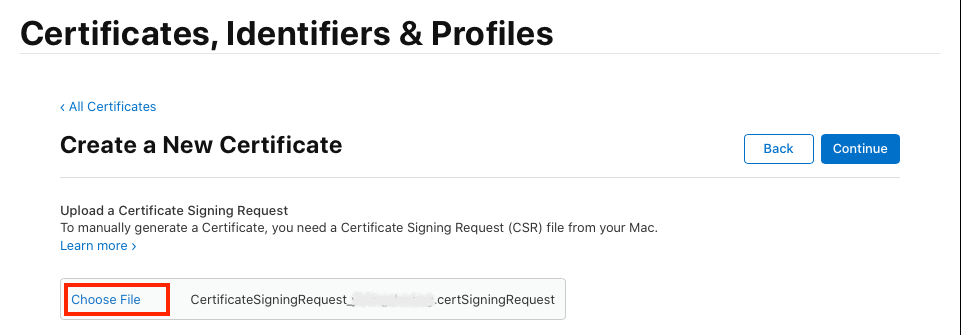

### Download the Certificate

You can see the detail information of your certificate. Check if `Certificate Type` is a correct [certificate](#Services-Certificates) that you choose. If you choose  `Apple Push Notification service SSL (Sandbox & Production)`, the certificate type is `Apple Push Services`. And If you choose `VoIP Services Certificate`, the certificate type is `VoIP Services`

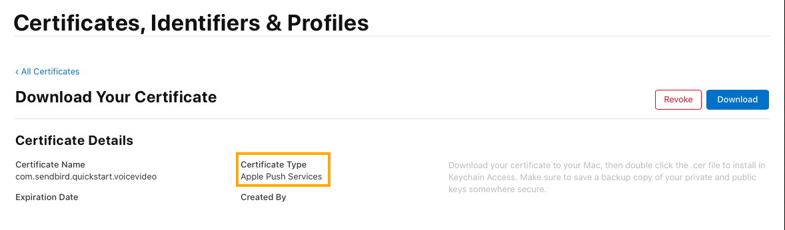

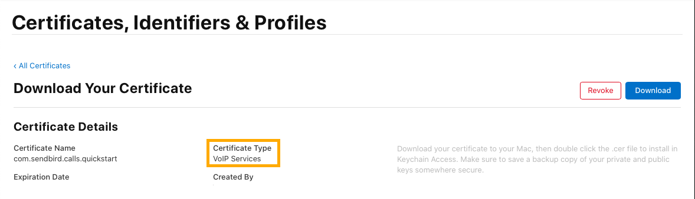

Now you've generated the certificate. Click `Download` and store the certificate in the `Finder`.

### Keychain Access

Double click the certificate that you've downloaded in the previous step, then you can see the certificate on your `Keychain Access` app. If you generated the certificate for `Apple Push Notification service SSL (Sandbox & Production)`, you can see the `Apple Push Services` certificate at the beginning of the certificate name on your keychain. And If you generated the `VoIP Services Certificate`, you can see `VoIP Services` certificate at the beginning of the certificate name.

There should be a `right-arrow` shape at the beginning of the certificate name. The arrow means you have your certificate and a matched private key. If you uploaded your CSR file in [the previous step](#Certificate-Signing-Request), you can see it.

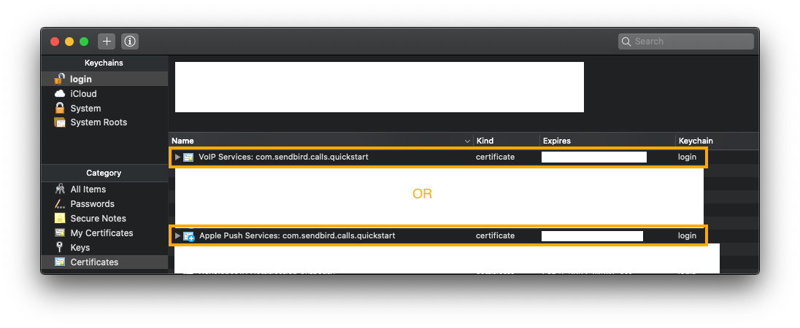

### Export Certificate & Private Key into Personal Information Exchange (p12)

Choose the certificate that you want to make to .p12. Right-click to see the next menu. Choose `Export "Apple Push Services: {bundle ID}` among them. 

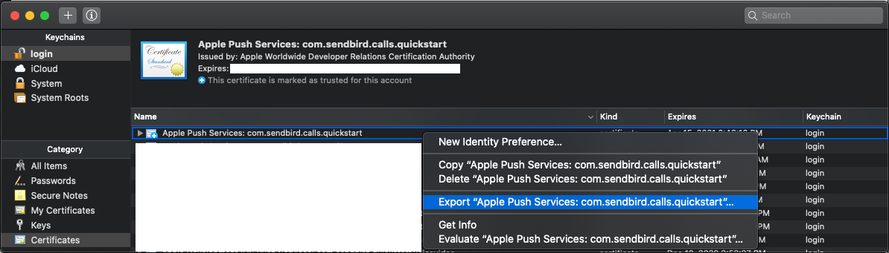

> You have to select the certificate with the certificate collapsed. When you collapse the certificate, a 'right arrow' is displayed. However, if the certificate has not been collapsed, a 'down arrow' is displayed at the beginning of the certificate name. If you expand the certificate to see the certificate with the private key, you need to select both files.

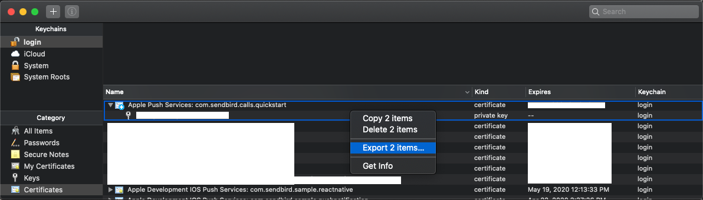
In this case, Choose `Export 2 items ...`

### Save .p12

Set the name of the p12 file. 

>  **We recommend a name that includes the service type and bundle ID**. For example, `apple_push_notification_com.sendbird.calls.quickstart` or` voip_services_com.sendbird.calls.quickstart`. You have a lot of certificates to develop / release the application, so a lot of developers are confused about what p12 file to use for VoIP push notifications. **This is a serious mistake**. That's why we recommend the naming policy in the manner mentioned above.

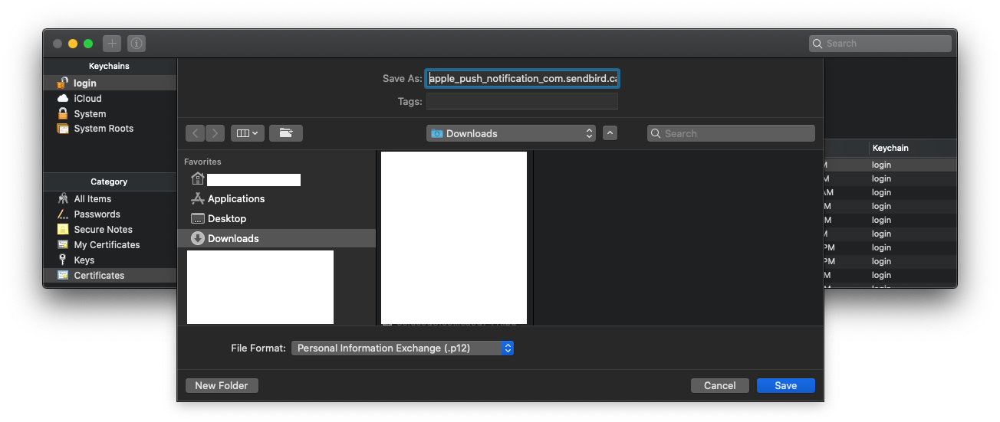

### Password for .p12

Enter a password. You can leave the field without password. But If so, It can be vulnerable to security. We recommend you to enter a password.

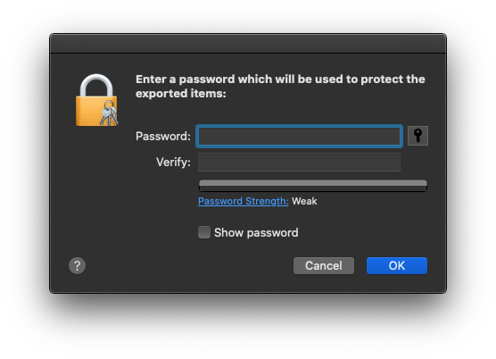

### Completed to Generate .p12

Now you've generated .p12 file for VoIP push notification.

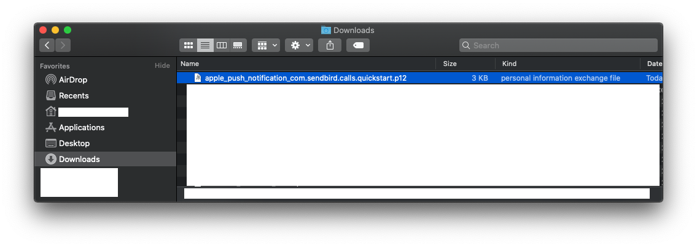

# Appendix

## How to Create CSR File

The following is the procedure for creating a Certificate Signing Request (CSR) file.

1. In your Mac open the Key Chain Access app → `Certificate Assistant` → then `Request a Certificate From a Certificate Authority....`
   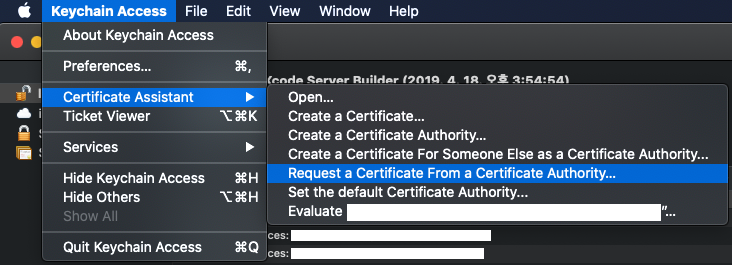

2. Enter your email and name in `User Email Address` and `Common Name`. Select `Saved on disk`, `Let me specify key pair information`. Then click the `Continue` button and go to the next step.
   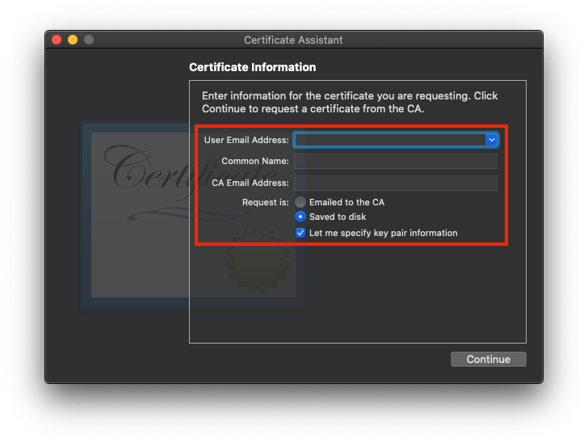

   >  `CA Email Address` is an optional field if you want to save the CSR file to your disk. If you want to email the CSR file to the CA, this field is mandatory.

3. Name your CSR file, like `CertificateSiginigRequest.certSigningRequest`. Click `Save` button.
   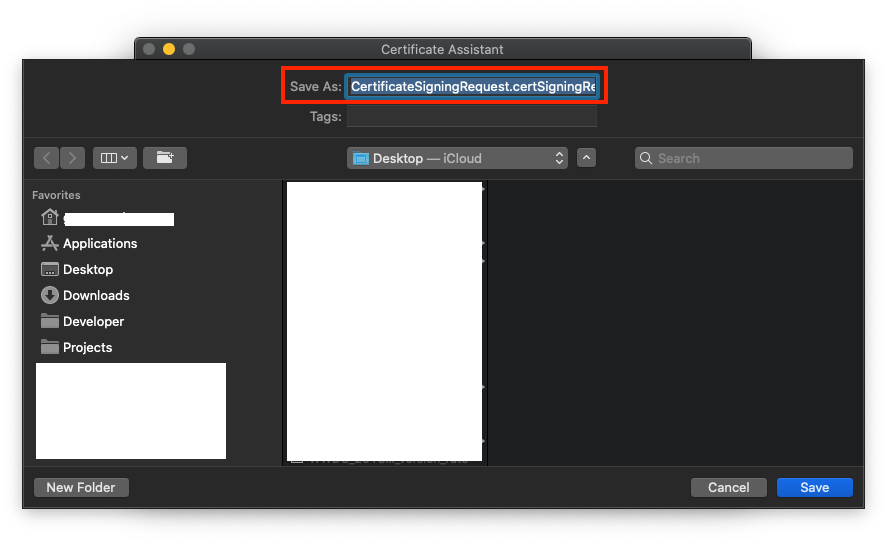

4. Choose key pair information. By default, the key size is 2048 bits and RSA algorithm is used. Click `Continue` button.
   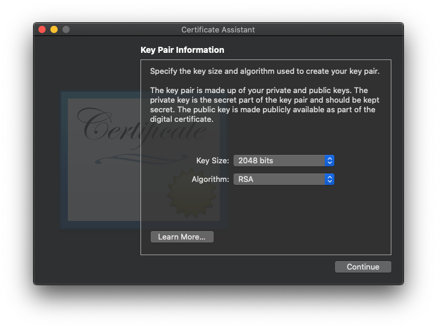

5. Completed to create CSR file.
   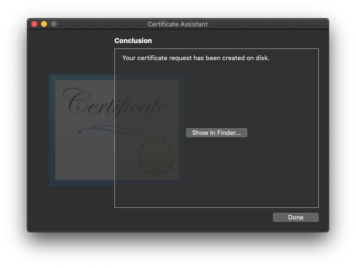
